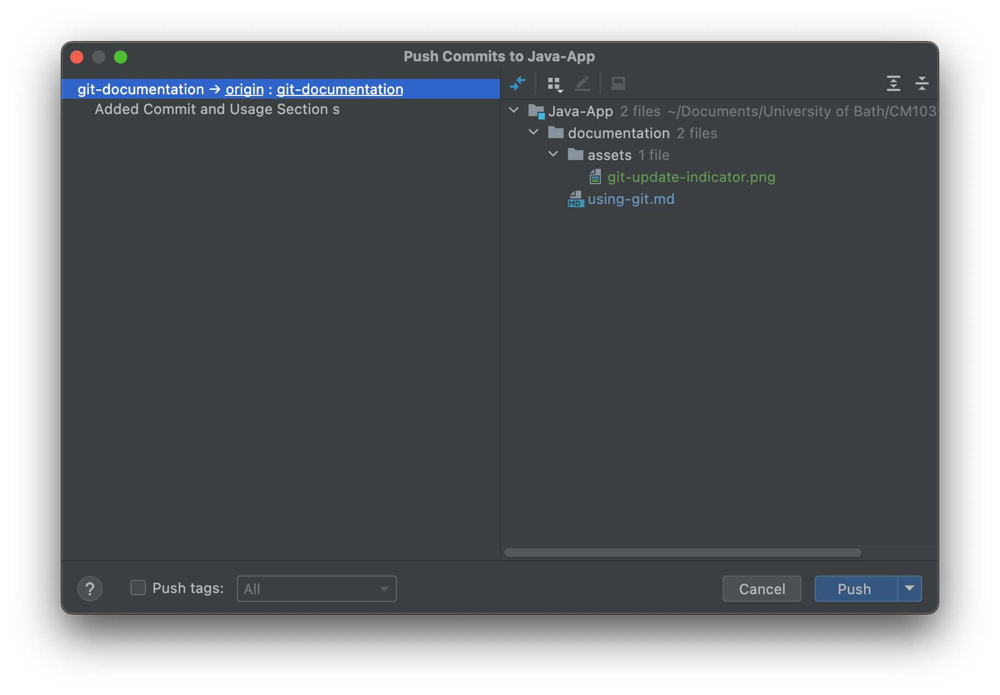
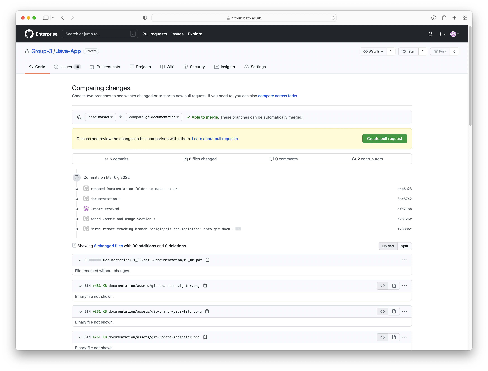

# Using Git/GitHub
## How we will use our Git repository
### One-branch One-person
Only one person should be working on a branch at a time. Additionally, a branch should be created for every 
requirement. If you _need_ to collaborate, be careful, so you don't mess up each other's code. You can also
branch from a branch if you wanted to.

### Remote Pull Only
Once you have finished with the functionality for the requirement. Make sure you push your code and create a pull 
request on GitHub (see how below). Do not try to pull in IntelliJ as it's hard to keep track what's going on. 

I (Book/pl673) will be responsible for checking through pull requests so please assign the pull request to me, and I 
will sort it out asap.

### Master branch should always be operational
Pull requests to master should only be accepted if the resulting code if functional.

## Committing Code
Committing code is done when you have made some change to the code and wants to keep a snapshot of it. You should 
probably commit your code every time you make a significant change to your code. To commit code go to `Git -> Commit...`.

### Commit Message
Commit message should be somewhat useful. Doesn't have to be long just as long as you can identify roughly what has 
been done since the last commit.

### Reverting to Last Commit
Committing code is also useful as it allows you to roll back any file to the last commit. To do so right-click a file 
and click `Git -> Rollback...`

## Pushing Code
Code that is committed cannot be seen by others yet and would only stay on your machine. To upload the changes to 
GitHub you need to _Push_ it. You should push your code regularly, so you don't forget (we are all working on 
different branches and conflicts is not something we need to worry about).

To push code go to `Git -> Push..`. A window will pop up.  
  
Make sure all your commits show up on the left side. And that your changes are shown on the right.

## Branching
Branching allows us to work on our own functions without the risk of overwriting others' code. Branching simply create 
a snapshot copy of the repository at the time, and you will be working on that. **Create a branch for each requirement 
and name it something like "YourName-Requirement"**.

To create a new branch, click the branch name in the bottom right corner of the window.  
  
> Note that the branch name shown here "git-documentation" will be different for you. This is because I am currently on
> the branch called "git-documentation". It will show the name of whichever branch you're currently working on

In most cases, you would want to branch from the _master_ branch, so simply click on _master_ then `New branch from 
'master'`

### Switching Between Branches
To switch between branches click the branch name in the bottom right. Click the branch you want to switch to then click 
`Checkout`. Note that you must have committed your changes on the previous branch before switching to another one.

## Pull Requests
Once you're done with the requirement and wants to merge your code into the _master_ branch (this should be done once 
you're happy with it), you can create a pull request to merge the changes in your branch into _master_.

> Note: you must have committed and pushed all of your changes before creating a pull request.

To do so, go to `github.bath.ac.uk` and navigate to the project and the repository. In the repository page, click "Pull 
requests" then "New pull request"  
  
Select to base to be your destination branch (_master_) and compare to your branch (in this case _git-documentation_).
Then click "Create pull request again"   
  
On this page **set the title of the pull request to the name of the requirement** then in the comment section describe 
briefly (but the more details the better) what functions/files you have made changes to (this will help if there's 
issues). 

You can assign the pull request to someone in the "Assignees" section on the right. In this case you can assign it to 
me (pl673) so I will be notified and can sort it out. Once done click "Create pull request".

## Fetching
Fetching tells IntelliJ to contact GitHub and checks for updates on the repository. Fetching does not _update_ the 
any files. That can be done later after the fetch.

To fetch updates, navigate to the bottom right corner at the branch name. Click the hollow blue down arrow in the top 
right corner of the popup.  
  

## Updating
Updating allows you to update files in your local repository to match the remote one (on GitHub). This can be done 
either with _Rebase_ or _Merge_. 

When merging is possible, IntelliJ will do so automatically. It will only prompt you 
to choose between the two if there's a _merge conflict_ meaning that there's changes both on your local repository and 
the remote repository in a way that the files can merge automatically. With us working on our own branches there 
shouldn't really be any merge conflict on the local side. If you are unsure just cancel it and check, drop me (Book) a
message, so I can check.

In order to update, click on the branch name on the button in the bottom right corner again. If you haven't done so, 
fetch.  
  
Note the blue arrow next to the branch name indicating that there's an incoming update. Click on the branch name, then 
click "Update...". If there's no arrow after fetching then there's no changes to update.

## Cloning
In order to load the project for the first time, we _clone_ the repository into the local machine. This can be done by
navigating to `File -> New -> Project from Version Control...`. The following window appears:  
  
Select GitHub Enterprise (as our project is on the university's enterprise GitHub), select the project, set the
destination directory then click "Clone".
> You may be asked for credentials. If you have, follow these steps:
> - Enter `github.bath.ac.uk` to the top field and click "Generate...". This should open the GitHub login page.
> - Sign in, scroll down to the bottom of the page and click "Generate"
> - Copy the token and paste it in IntelliJ then click sign in,

Once cloned, IntelliJ should open the project automatically. If not, go to `File -> Open...` then navigate to the folder
you set as the destination folder.
