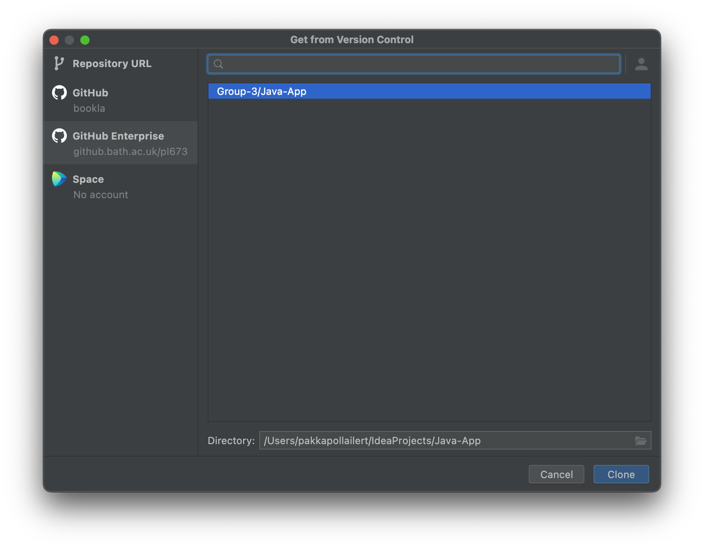

# Using Git/GitHub
## Cloning
In order to load the project for the first time, we _clone_ the repository into the local machine. This can be done by 
navigating to `File -> New -> Project from Version Control...`. The following window appears:

Select GitHub Enterprise (as our project is on the university's enterprise GitHub), select the project, set the 
destination directory then click "Clone".
> You may be asked for credentials. If you have, follow these steps:  
> - Enter `github.bath.ac.uk` to the top field and click "Generate...". This should open the GitHub login page. 
> - Sign in, scroll down to the bottom of the page and click "Generate"
> - Copy the token and paste it in IntelliJ then click sign in,

Once cloned, IntelliJ should open the project automatically. If not, go to `File -> Open...` then navigate to the folder
you set as the destination folder.

## Fetching
Fetching tells IntelliJ to contact GitHub and checks for updates on the repository. Fetching does not _update_ the 
any files. That can be done later after the fetch.

To fetch updates, navigate to the bottom right corner at the branch name.

> Note that the branch name shown here "git-documentation" will be different for you. This is because I am currently on 
> the branch called "git-documentation". It will show the name of whichever branch you're currently working on

Click the hollow blue down arrow in the top right corner of the popup.

## Updating
Updating allows you to update files in your local repository to match the remote one (on GitHub). This can be done 
either with _Rebase_ or _Merge_. 

When merging is possible, IntelliJ will do so automatically. It will only prompt you 
to choose between the two if there's a _merge conflict_ meaning that there's changes both on your local repository and 
the remote repository in a way that the files can merge automatically. With us working on our own branches there 
shouldn't really be any merge conflict on the local side. If you are unsure just cancel it and check, drop me (Book) a
message, so I can check.

In order to update, click on the branch name on the bottom right corner again.

### Rebase
Rebase simply replace your local repository with the remote one. This is done **only** if you want to **discard all your
(uncommitted) local changes** and just restart where the remote repository is. You probably only want to rebase the 
_master_ branch,
